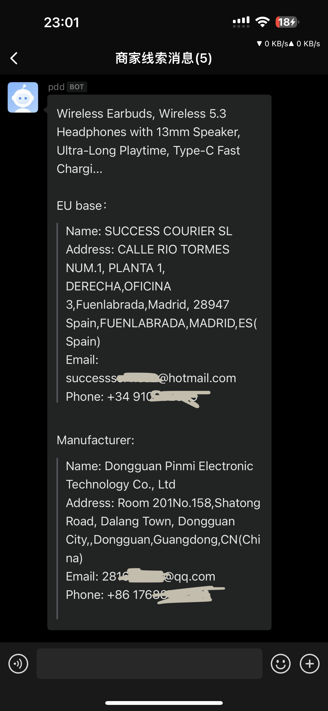

# Temu商家数据采集-自动化脚本

## 项目简介

本项目是一个基于 Auto.js 的自动化脚本，用于在 Temu 应用中实现商品信息采集与上传功能。脚本通过模拟用户操作，自动浏览商品、获取商家信息，并将数据发送至指定服务器。

## 功能特性

- **自动切换分类**：进入“xxx”分类页面。
- **随机点击商品**：从商品列表中随机选择一个商品进行查看。
- **商品详情页处理**：
  - 获取商品名称。
  - 滑动到“Safety information and contacts”区域。
  - 提取商家信息并截图。
- **数据上传**：
  - 将商品名称、商家信息及图片（Base64 编码）打包成 JSON 格式。
  - 通过 POST 请求发送至 `http://120.24.222:48091/temu/upload` 接口。
- **异常处理**：
  - 处理网络超时和请求错误。
  - 自动回退并继续执行下一轮任务。

## 使用说明

### 环境要求

- 安装应用。
- 手机开启无障碍服务权限。
- 确保设备已授权屏幕截图权限（可通过云控工具一次性授权）。

### 脚本运行步骤

1. 将 [1.js] 文件导入 Auto.js。
2. 启动脚本后，自动打开 Temu 应用并进入电子商品分类。
3. 脚本会持续循环执行以下流程：
   - 刷新商品列表。
   - 随机点击一个商品。
   - 进入商品详情页，滑动至“Safety information and contacts”区域。
   - 提取商家信息并上传至服务器。
   - 返回主页面，等待随机时间后重复上述流程。

## 数据上传接口

- **URL**: `http://120.24:48091/temu/upload`
- **请求方法**: `POST`
- **请求头**:
  
#### 联系QQ229161791